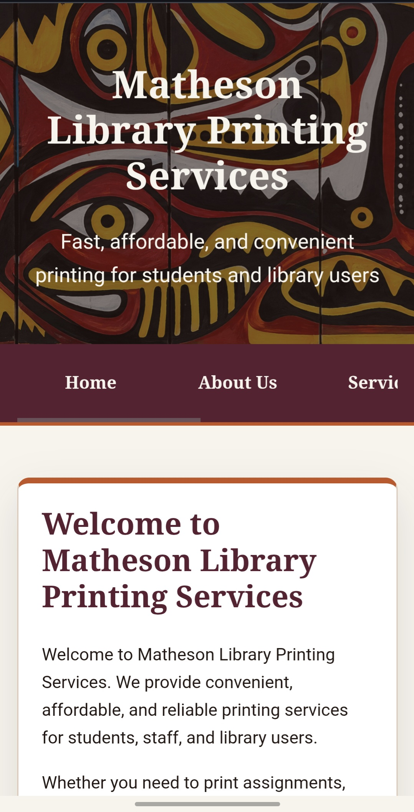
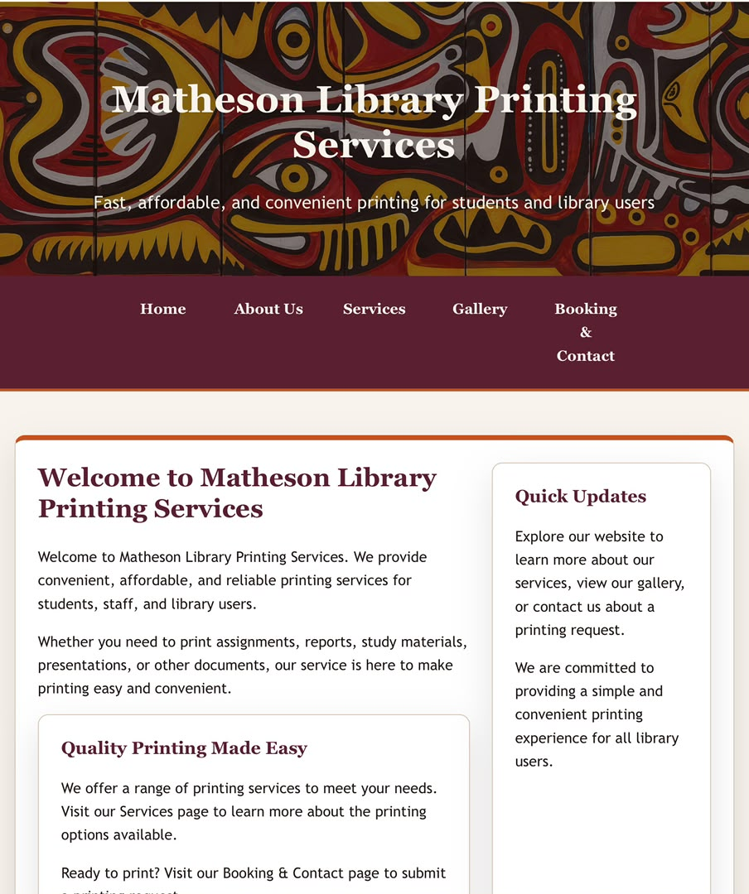
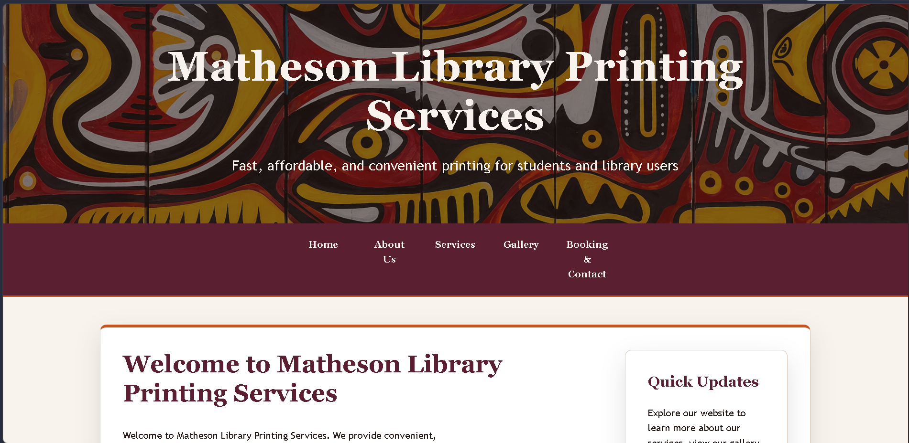

# Matheson Library Printing Services

IS229 Assessment 3 responsive web design project by Joseph Seeto.

## Links to My Website

GitHub Repository URL: https://github.com/root19-hash/Assessment-3_Web-Design-Using-HTML5-CSS3---Responsive-Website.git

Live Website URL: https://root19-hash.github.io/Assessment-3_Web-Design-Using-HTML5-CSS3---Responsive-Website/

## Audience

The website is designed for students, staff, and members of the public who need library printing information or want to submit a print request.

## Finding Printing Service Information

Users can:

- View available printing and photocopying services
- See available paper sizes and printing types
- Read instructions for using the printing service
- Find relevant information before visiting the library

**Example user task:**

> "I want to know what printing services the library provides."

## Submit a Print Request

Users can complete a print request form containing information such as:

- Name
- Student/Staff ID
- Email
- Document name
- Number of copies
- Print type
- Paper size
- Additional instructions

This feature is especially useful because the assignment requires at least one substantial form with labels, suitable input types, and HTML5 validation.

## Find Contact and Service Information

Users can:

- Find the library's location
- View opening hours
- Find phone, email, and other contact details
- Get directions and other relevant information

**Example user task:**

> "I need to know where the printing service is and when it is open."

## Pages

- `index.html` - homepage and printing service overview
- `services.html` - available services, prices, paper sizes, and instructions
- `contact.html` - booking form, operating hours, contact details, and map
- `gallery.html` - printing examples, facilities, and walkthrough video
- `about.html` - service mission and reasons to choose the service

## Technologies and constraints

This is a static website using semantic HTML5 and custom CSS3. Layout uses Flexbox and CSS Grid with responsive changes below `640px`, from `640px` to `991px`, and from `992px` upward. No JavaScript or external frameworks are used.

## Assets

Images are stored in `Images/` and the video is stored in `Video/`. Relative paths preserve the existing folder capitalization and filenames.

## Responsive checks

The intended test viewports are:

| Viewport                      | Structural check                                                                      | Result                                                |
| ----------------------------- | ------------------------------------------------------------------------------------- | ----------------------------------------------------- |
| Mobile, approximately 375px   | Navigation stays in one horizontal row and can scroll; tables can scroll horizontally | Implemented in CSS; browser inspection still required |
| Tablet, approximately 768px   | Two-column Grid layouts appear where appropriate                                      | Implemented in CSS; browser inspection still required |
| Desktop, approximately 1200px | Three-column content grids and wide layouts are available                             | Implemented in CSS; browser inspection still required |

## Evidence Screenshot of Responsiveness

1. Mobile
   

2. iPad
   

3. Desktop
   

## Verification completed

- All five pages link to `style.css`.
- HTML container tags were checked for balanced opening and closing tags.
- Local image and video paths were checked against the `Images/` and `Video/` folders.
- `git diff --check` passed after the latest edits.

## Project Structure

A3/
├── Screenshot/
├── Images/
├── Video/
├── about.html
├── contact.html
├── gallery.html
├── index.html
├── LICENSE
├── README.md
├── services.html
└── style.css

## Assistance Received

GitHub Copilot helped with the following project tasks while the project owner reviewed and controlled the final changes:

- Reviewed the existing A2 HTML structure and helped plan a consistent visual system.
- Built and refined the custom CSS design tokens, typography, spacing, colors, buttons, forms, Flexbox layouts, Grid layouts, and responsive breakpoints.
- Improved the navigation bar, including its horizontal layout, maroon background, readable text, and mobile overflow behavior.
- Removed the unnecessary horizontal Quick Updates banner from the homepage.
- Improved image and video handling with responsive media frames, descriptive alt text checks, and lazy-loading attributes.
- Added accessibility support including visible keyboard focus, skip links, semantic landmarks, form labels, and reduced-motion support.
- Checked the pages in a browser at mobile, tablet, and desktop viewport settings for overflow, navigation behavior, layout structure, and focus states.
- Helped review Git changes, create focused milestone commits, and push the approved changes to the `origin main` GitHub repository.

## AI Use Declaration

AI tools were used as learning and review assistance, not as a replacement for the project owner's decisions. The project owner reviewed the code, selected the final changes, remains responsible for the content and testing, and retains direct control of the GitHub repository and final submission.
