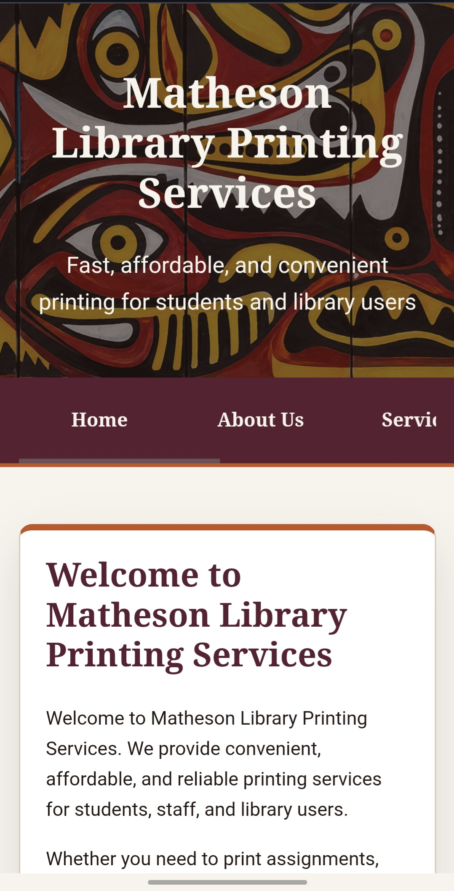
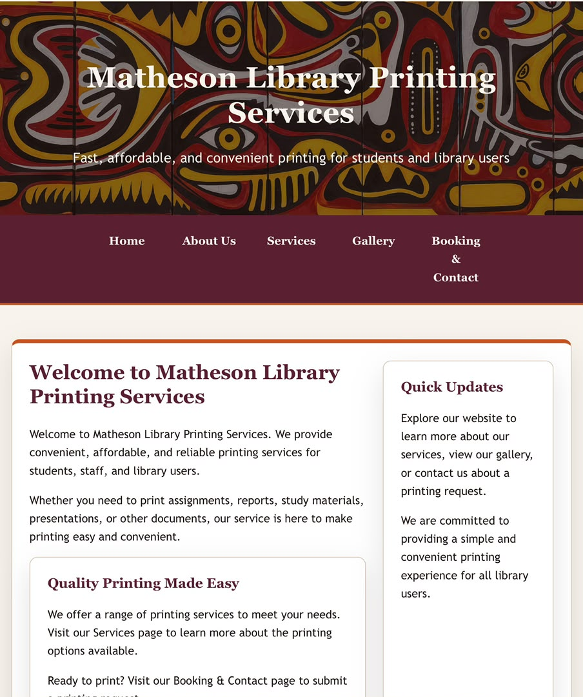
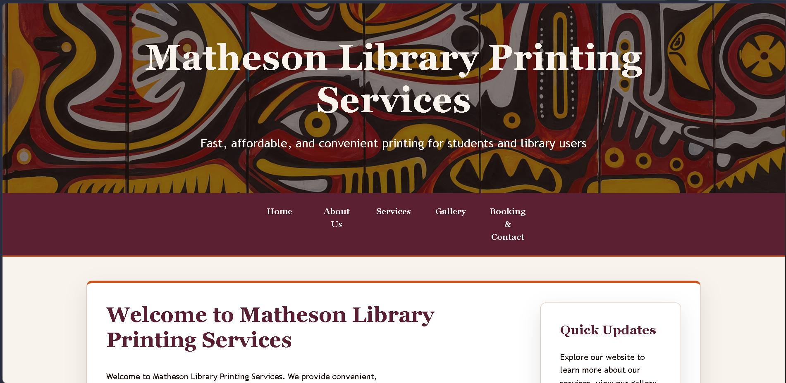

# Matheson Library Printing Services

IS229 Assessment 3 responsive web design project by Joseph Seeto.

## Links to My Website

GitHub Repository URL: https://github.com/root19-hash/Assessment-3_Web-Design-Using-HTML5-CSS3---Responsive-Website.git

Live Website URL: https://root19-hash.github.io/Assessment-3_Web-Design-Using-HTML5-CSS3---Responsive-Website/

## Audience

The website is designed for students, staff, and members of the public who need library printing information or want to submit a print request.

## Finding Printing Service Information

Users can:

- View available printing and photocopying services
- See available paper sizes and printing types
- Read instructions for using the printing service
- Find relevant information before visiting the library

**Example user task:**

> "I want to know what printing services the library provides."

## Submit a Print Request

Users can complete a print request form containing information such as:

- Name
- Student/Staff ID
- Email
- Phone number
- Document name
- Selected service
- Number of copies
- Print type
- Paper size
- Additional instructions

Users can use the print request form to provide their name, Student/Staff ID, email address, phone number, document name, selected service, number of copies, print type, paper size, and optional additional instructions.

## Find Contact and Service Information

Users can:

- Find the library's location
- View opening hours
- Find phone, email, and other contact details
- Get directions and other relevant information

**Example user task:**

> "I need to know where the printing service is and when it is open."

## Pages

- `index.html` - homepage and printing service overview
- `services.html` - available services, prices, paper sizes, and instructions
- `contact.html` - print request form, operating hours, contact details, and map
- `gallery.html` - printing examples, facilities, and walkthrough video
- `about.html` - service mission and reasons to choose the service

## Technologies and constraints

This is a static website using semantic HTML5 and custom CSS3. Layout uses Flexbox and CSS Grid with responsive changes below `640px`, from `640px` to `991px`, and from `992px` upward. No JavaScript or external frameworks are used.

## Design System

Colour variables: `--terracotta: #c65320`, `--terracotta-dark: #9f3f1b`, `--maroon: #5b1f32`, `--maroon-dark: #3e1422`, `--chocolate: #241915`, `--cream: #f8f4ed`, `--paper: #fffaf3`, `--surface: #ffffff`, `--border: #dbc8b8`, and `--muted: #695b54`.

Headings, table headings, buttons, and navigation links use `Georgia, "Times New Roman", serif`; body text uses `"Trebuchet MS", Verdana, sans-serif`.

Spacing uses rem-based tokens: `--space-1: 0.35rem`, `--space-2: 0.7rem`, `--space-3: 1rem`, `--space-4: 1.5rem`, `--space-5: 2rem`, `--space-6: 3rem`, and `--space-7: 4.5rem`. Other spacing uses rem-based `gap`, `padding`, and margin declarations, including nav `gap: 0.5rem`, grid `gap: 1.5rem`, and link `padding: 0.65rem 0.9rem`.

## Assets

Images are stored in `Images/` and the video is stored in `Video/`. Relative paths preserve the existing folder capitalization and filenames.

## Responsive Testing

**Tested with:** Microsoft Edge DevTools device mode at 375px, 768px and 1200px on all five pages, plus an automated Playwright audit (run through GitHub Copilot) at 320px to 1400px on the local files.

| Viewport        | Result                                                                                                                                                                            |
| --------------- | --------------------------------------------------------------------------------------------------------------------------------------------------------------------------------- |
| Mobile, 375px   | Pass. No sideways page scroll; navigation is a swipeable row; single column; images and video fit; services table scrolls inside its own box; contact form fields are full width. |
| Tablet, 768px   | Pass. No page overflow; nav labels on one line; two-column layouts; 16px body text.                                                                                               |
| Desktop, 1200px | Pass. No page overflow; nav labels on one line; three-column grids display.                                                                                                       |

The audit covered 35 page and width combinations with no page overflow. Layouts change at 640px (two columns) and 992px (three columns).

**Accessibility:** visible keyboard focus and a working skip link; all 10 contact form fields have labels; body text contrast is 17:1 and body text is 16px.

**Issue found and fixed:** navigation labels ("About Us", "Booking & Contact") wrapped onto several lines on tablet and desktop. The equal-width grid columns were too narrow, so the columns now size to their labels and the labels stay on one line.

**Known limits:** inline links reach 4.34:1 contrast on hover, just under the 4.5:1 target, and some inline text links are smaller than 44px on mobile. The gallery video's playback was not verified by the automated audit. Real touch devices, other browsers and screen readers were not tested.

## Evidence Screenshot of Responsiveness

1. Mobile
   

2. iPad
   

3. Desktop
   

## Verification completed

- All five pages link to `style.css`.
- HTML container tags were checked for balanced opening and closing tags.
- Local image and video paths were checked against the `Images/` and `Video/` folders.
- `git diff --check` passed after the latest edits.

## Project Structure

A3/
├── Screenshot/
├── Images/
├── Video/
├── about.html
├── contact.html
├── gallery.html
├── index.html
├── LICENSE
├── README.md
├── services.html
└── style.css

## Git History

- Define structured CSS Grid content layouts
- Add mobile tablet and desktop breakpoints
- Refine design tokens typography and spacing
- Align quick updates across responsive pages
- Restore nav appearance without label wrapping
- Update README responsive testing summary

## Assistance Received

GitHub Copilot helped with the following project tasks while the project owner reviewed and controlled the final changes:

- Reviewed the existing HTML structure and helped plan a consistent visual system.
- Built and refined the custom CSS design tokens, typography, spacing, colors, buttons, forms, Flexbox layouts, Grid layouts, and responsive breakpoints.
- Improved the navigation bar, including its horizontal layout, maroon background, readable text, and mobile overflow behavior.
- Removed the unnecessary horizontal Quick Updates banner from the homepage.
- Improved image and video handling with responsive media frames, descriptive alt text checks, and lazy-loading attributes.
- Added accessibility support including visible keyboard focus, skip links, semantic landmarks, form labels, and reduced-motion support.
- Checked the pages in a browser at mobile, tablet, and desktop viewport settings for overflow, navigation behavior, layout structure, and focus states.
- Helped review Git changes, create focused milestone commits, and push the approved changes to the `origin main` GitHub repository.

## AI Use Declaration

AI tools were used as learning and review assistance, not as a replacement for the project owner's decisions. The project owner reviewed the code, selected the final changes, remains responsible for the content and testing, and retains direct control of the GitHub repository and final submission.
